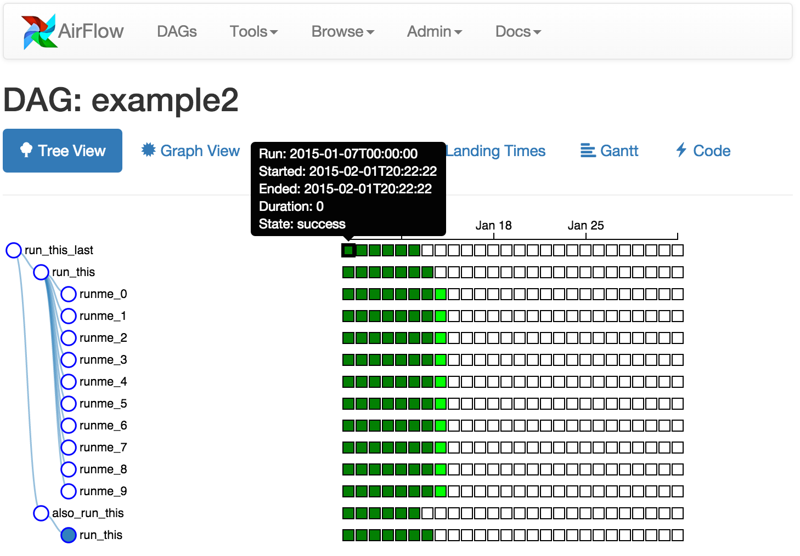

# UI/截图

通过Airflow UI，您可以轻松监控data pipeline（管道）并对其进行故障排除。如下是一些特性的简单预览和一些您可以在Airflow的UI中找到的可视化效果。
=======
> 译者：[@ImPerat0R\_](https://github.com/tssujt)

## DAGs查看

您环境中的DAG列表，以及一系列进入常用页面的快捷方式。您可以一目了然地查看成功、失败及当前正在运行的任务数量。

* * *

* * *

## 树视图

跨越时间的DAG的树表示。如果pipeline（管道）延迟了，您可以很快地看到哪里出现了错误的步骤并且辨别出堵塞的进程。

* * *

* * *

## 图表视图

图形视图可能是最全面的一种表现形式了。它可以可视化您的DAG依赖以及某个运行实例的当前状态。

* * *

* * *

## 变量视图

变量视图允许您列出、创建、编辑或删除作业期间使用的变量的键值对。如果密钥默认包含（'password'，'secret'，'passwd'，'authorization'，'api_key'，'apikey'，'access_token'）中的任何单词，则隐藏变量的值，但可以配置以明文显示。

* * *

* * *

## 甘特图

甘特图可让您分析任务持续时间和重叠情况。您可以快速识别系统瓶颈和哪些特定DAG在运行中花费了大量的时间。

* * *

* * *

## 任务持续时间

过去N次运行的不同任务的持续时间。通过此视图，您可以查找异常值并快速了解DAG在多次运行中花费的时间。

* * *

* * *

## 代码视图

透明就是一切。虽然您的pipeline（管道）代码在源代码管理中，但这是一种快速获取DAG代码并提供更多上下文的方法。

* * *

* * *

## 任务实例上下文菜单

从上面的页面（树视图，图形视图，甘特图......）中，始终可以单击任务实例，并进入此丰富的上下文菜单，该菜单可以将您带到更详细的元数据并执行某些操作。

* * *

